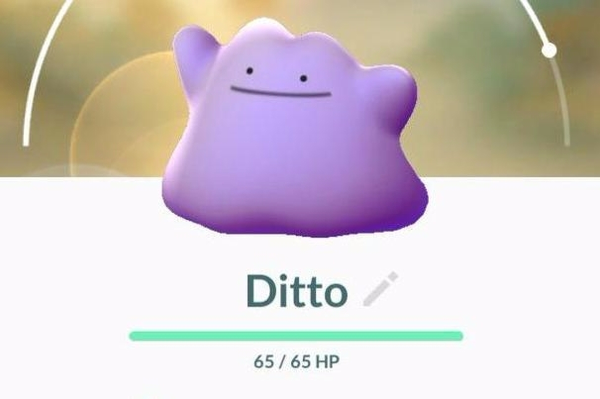
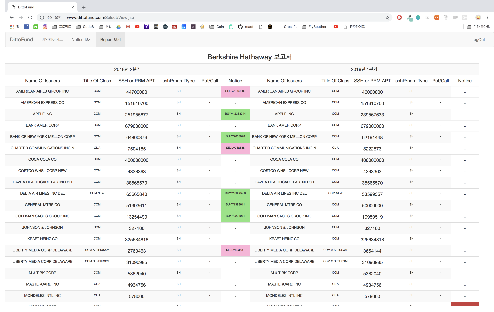

# This is Dittofund_renewal Page

## What is Dittofund?

- Dittofund는 Ditto + Fund의 결합어입니다.
  - 이 캐릭터 혹시 알고 계세요?
  - Ditto는 우리에게 메타몽 이라는 이름으로 알려진 포켓몬입니다. 남의 모습을 복사하는 능력을 갖고 있죠.
  - Fund는 우리가 잘 아는 투자상품의 펀드도 있지만 여기서는 헤지펀드를 말합니다.

- 미국은 분기별로 헤지펀드의 포트폴리오를 정부에 공개해야 하는 법을 시행하고 있습니다.
  - 이 말은 실시간은 아니지만 분기별로는 모든 헤지펀드들의 포트폴리오의 변동을 파악할 수 있다는 말이죠.
  - 만약 우리가 워렌 버핏의 포트폴리오를 따라할 수 있다면, 버핏만큼은 아니겠지만 그래도 어느 정도는 버핏과 유사한 형태의 이익을 얻을 수 있겠죠?
  - Dittofund는 그런 유형의 투자를 할 때 참고자료를 제공해주는 서비스입니다.

## Dittofund v.1

- 옛날에 한 번 만들어 본 적이 있는 사이트입니다.
- 그 때는 단순 JSP+MySQL만을 사용했습니다. Spring이라는 게 있는지도 몰랐었죠.
- 이번에는 Django를 기반으로 만들어볼까 합니다.

--------

## Model Relationship

- 이 프로젝트는 3개의 클래스로 구분됩니다.
  - 헤지펀드
  - 포트폴리오(이것을 작성한 헤지펀드의 소유)
  - 데이터(이것이 속한 포트폴리오의 소유)
- 그러니 헤지펀드 > 포트폴리오 > 데이터의 관계가 그려집니다.
- 헤지펀드 모델은 다음과 같은 값을 갖습니다.
  - 이름
- 포트폴리오 모델은 다음과 같은 값을 갖습니다.
  - 소유주 : 헤지펀드의 이름으로 구분
  - 작성연도 
  - 작성분기 : 1~4의 값 중 하나
  - URL : 실제 XML 파일의 URL
- 데이터 모델은 다음과 같은 값을 갖습니다.
  - 포트폴리오 : 이하 데이터가 적혀 있는 포트폴리오 모델의 객체
  - name : 해당 종목의 이름
  - title_of_class : 해당 종목의 그룹명?
  - cusip : ID 같은 것으로 추정됨
  - shares : 해당 종목의 주식 수
  - values : 해당 종목의 보고서 작성 당시의 현재가치